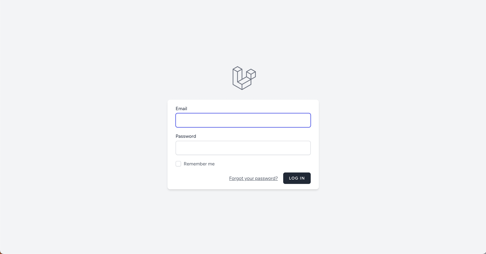
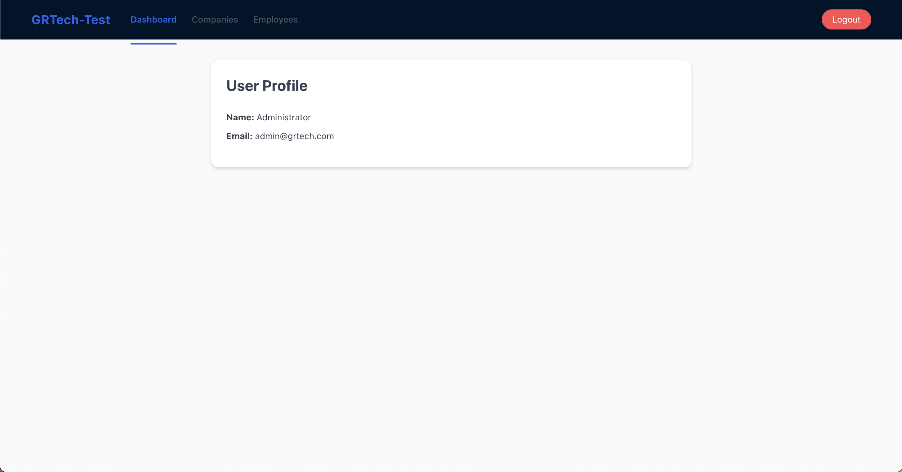
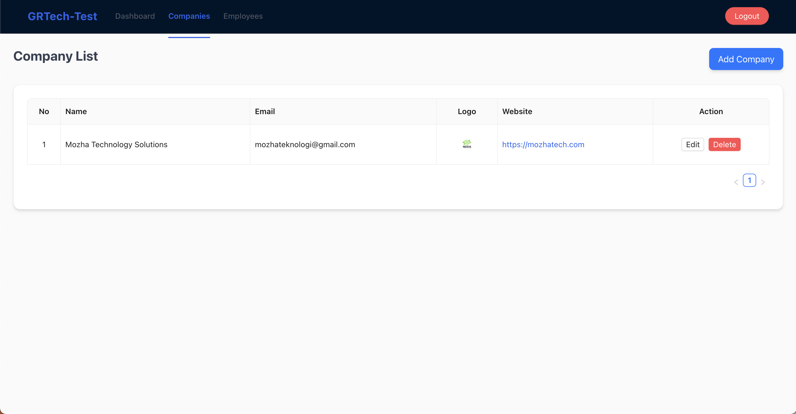
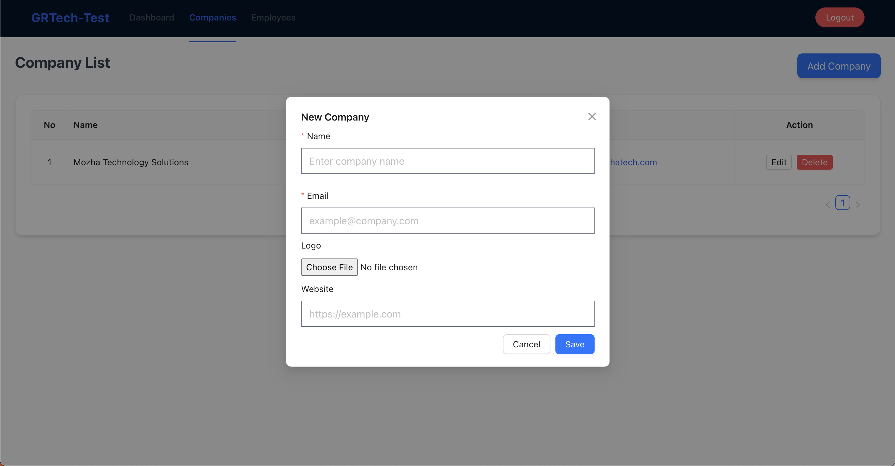
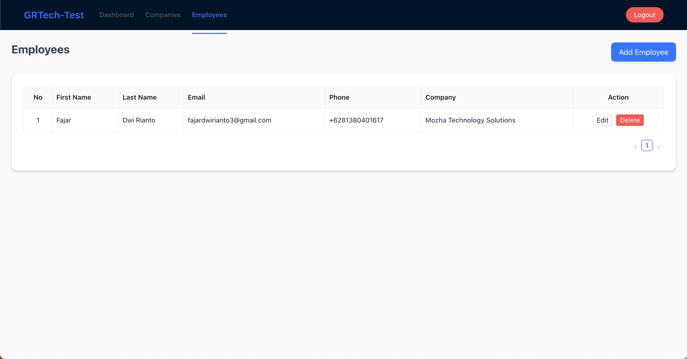
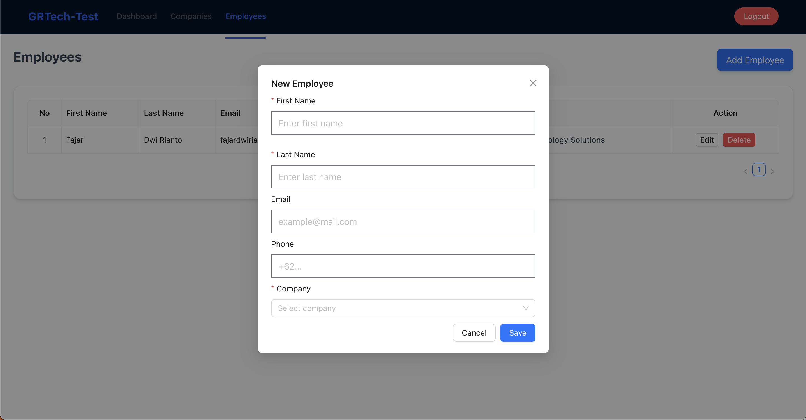

# GRTech Assessment - Laravel 12 + Vue (Inertia + Ant Design Vue)

## Overview

This Project is a **Company & employee Management System** built with:

- **Backend**: Laravel 12
- **Frontend**: Vue 3 with Inertia.js
- **UI Library**: Ant Design Vue + TailwindCSS
- **Database**: MySQL

Features implemented according to the asssessent PDF:

- Authentication (Login, Logout)
- Dashboard with logged-in user profile
- Company management (CRUD + Company logo)
- Employee management (CRUD + Linked to company)
- Pagination, validation, and clean API responses
- UI/UX design wiwth Ant Design Vue components

---
## Installation

### 1. Clone Repository

```bash
git clone https://github.com/fajarpostman/grtech-assessment-laravel.git
cd grtech-assessment-laravel
```

### 2. Backend setup

```bash
cp .env.example .env
composer install
php artisan key:generate
```

configure .env for your database:

```bash
DB_CONNECTION=mysql
DB_HOST=127.0.0.1
DB_PORT=3306
DB_DATABASE=gr_tech_assessment
DB_USERNAME=root
DB_PASSWORD=
```

Run migration & seeders:
```bash
php artisan migrate --seed
```

Run backend server:
```bash
npm install
npm run dev
```

### 3. Frontend setup (Vue + Inertia)

```bash
npm isntall
npm run dev
```

---
## Usage

- 1. Visit https://127.0.0.1:8000
- 2. Login with seeded admin account.
- 3. Use the navigation bar:
    - Dashboard: View & update logged-in user profile
    - Companies: Manage company data with logo upload
    - Employees: Manage employees linked to companies

---
## API Endpoints

### Companies
- GET /api/companies: List companies (paginated)
- POST /api/companies: Create company
- POST /api/companies/{id}: Update company
- DELETE /api/companies/{id}: Delete company

### Employees
- GET /api/employees: List employees (paginated)
- POST /api/employees: Create employee
- POST /api/employees/{id}: Update employee
- DELETE /api/employees/{id}: Delete employee

---
- Login


- Dashboard


- Companies



- Employee



---
## Tech Stack

- Laravel 12
- Inertia.js
- Vue 3 Composition API + <script setup>
- Ant Design Vue (UI Components)
- TailwindCSS (styling utility classes)
- MySQL (Database)

---
## Author
Develop by **Fajar Dwi Rianto** as part of the GRTehc Technical Assessment.